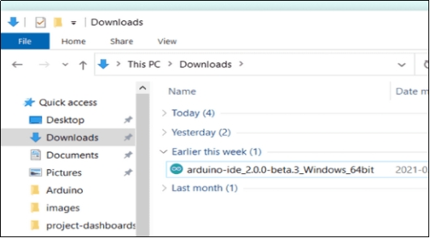
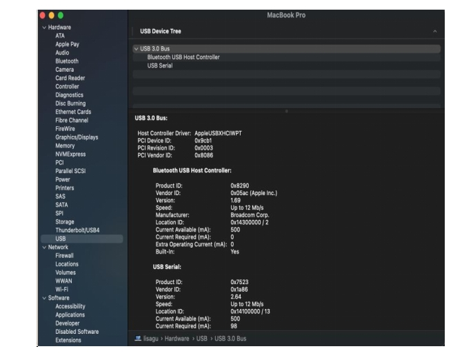
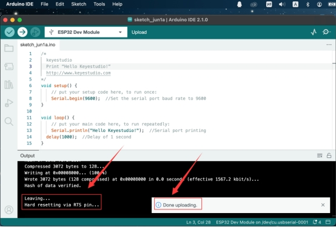

# HolaSmart ESP32 PLUS Development Board


## 1、Board Description

### 1.1 Introduction

Based on ESP32 development board, this board integrates ESP32-WROOM-32 module and supports WIFI+Bluetooth. Its pins are compatible with Arduino, and multiple peripherals are welded on board, including Hall sensor, high-speed SDIO/SPI, UART, I2S and I2C, all of which can be operated on freeRTOS system. So, it is perfect for solutions of IOT and smart home.

---


 ### 1.2 Parameters

| Output voltage          | 3.3V-5V               |
| ----------------------- | --------------------- |
| Output current          | MAX: 1.2A             |
| Maximum power           | Max output 10W        |
| Operating temperature   | -10~50 Degree Celsius |
| Dimensions              | 69*54*14.5mm          |
| Weight                  | 25.5g                 |
| Environmental attribute | ROHS                  |

---


### 1.3 Pin-out


---


### 1.4 Schematic Diagram


---


## 2、Get started with Arduino

### 2.1 Download Arduino IDE

**A.Windows System**

You could download Arduino IDE from the official website: [https://www.arduino.cc/](https://www.arduino.cc/)

Enter the link and click **SOFTWARE**:


There are various versions of IDE for Arduino. Just download a version compatible with your system.


Here we will show you how to download and install the windows version of Arduino IDE.

There are two versions of IDE for WINDOWS system. You can choose between the installer (.exe) and the Zip file. For installer, it can be directly downloaded, without the need of installing it manually while for Zip package, you will need to install the driver manually.


ou just need to click **JUST DOWNLOAD**.


**B. Mac System**

The versions of Arduino IDE vary from operation systems.

For how to download Arduino IDE on Mac, please refer to Windows:


After downloading, double-click to open it and follow the installation instructions.


**C.** **Detailed installation steps：**

1.Save the .exe file downloaded from the software page to your hard drive and simply run the file .




2.Read the License Agreement and agree it.


3.Choose the installation options.


4.Choose the install location.


5.Click finish and run Arduino IDE


---

 ###  2.2 Download Driver

We need a driver to boot our development board. Or else, the COM port connected to computer will not be found.

**A.Install CH340 Driver on Windows System**

Download: [https://fs.keyestudio.com/CH340-WINDOWS](https://fs.keyestudio.com/CH340-WINDOWS)

Windows 10 (and later systems) boasts their own drivers, so there is no need to install additional drivers.

Connect the control board to your computer.

Click Computer– Properties – Device Manager, as shown below. This indicates a successful connection, so the installation of driver is not required.


If the following situation occurs, you need to manually install the driver.


Click  to select “Update driver”. And then the driver will start to install.


Tap “Browse my computer for drivers”.


Find the file **usb_ch341_3.1.2009.06** or **cp210x** you have downloaded, and click “Next”.


After finishing installing, click “Close” and the serial port number will show up.


The driver is successfully installed!
Click Computer– Properties – Device Manager to check:


**B.Install CH340 Driver on MAC System**
**Step 1:** Download the driver from the Website and extract the file to the local installation directory.
[https://fs.keyestudio.com/CH340-MAC](https://fs.keyestudio.com/CH340-MAC)


**Step 2**: For details about how to install the driver in pkg format by default, see Step 3. If OS X 11.0 or later does not support Rosetta, refer to Step 4 to install the dmg driver.

Before installation, please forward to “System Preferences” -> “Security & Privacy” -> “General” page, below the title “Allow apps downloaded from:” choose the choice 2 -> “Mac App Store and identified developers”, then the driver will work normally.


**Step 3**: To install the driver in pkg format, tap the driver file → Continue→ Install


Then the installation will be successful.


To install the pkg format driver on OS X 11.0 and later: Open “LaunchPad” → “CH34xVCPDriver” → Install.


When using OS X 10.9 to OS X 10.15, click “Restart” to restart your computer, and perform the following steps after the restart.


**Step 4**: To install the dmg driver, tap the dmg file and drag “CH34xVCPDriver” to enter the application folder in the operating system.


Then open “LaunchPad” → “CH34xVCPDriver” → Install.


Then the installation will be successful.


When inserting the CH340 control board into the USB port, open System Report -> Hardware ->USB. On the right is USB Device Tree. If the USB device is working properly, you will find a device whose “Vendor ID” is [0x1a86].




Open “Terminal” program under Applications-Utilities folder and type the command “ls /dev/tty*”.


You should see the “tty.wchusbserialx” where “x” is the assigned device number similar to Windows COM port assignment.

---


### 2.3 Arduino IDE

Click  icon to open Arduino IDE.


1.“File”: Including New Sketch, Open…, Sketchbook, Examples, Close, Save(Save as…), Preferences, Advanced…, etc.

2.“Edit”: Including Copy, Paste, Auto Format, Increase/Decrease Font Size, etc. Commonly, you can use shortcuts to do these operations.

3.“Sketch”: Including Verify/Compile, Upload, Include Library, etc.

4.“Tools”: Including Board and Port, which are two of the most important functions.

5.“Help”: Including Check for Updates as well as some official data references.

6.“Serial Plotter”: To display the data from serial port in the way of a line chart.

7.“Serial Monitor”: To prints the data from serial port.

8.Verify code.

9.Verify and upload code.

10.“Sketchbook”: To create a new sketch, or sign in to Arduino Cloud to sync and edit your Cloud Sketches.

11.“Boards Manager”: To install or remove development board.

12.“Library Manager”: To install or remove library.

13.“Debug”: To monitor code and debug breakpoints.

14.Search.

15.Sketch editing area.

16.IDE Output: To report error or successful uploading, and to display data from serial monitor.

---


### 2.4 Upload Code

**A. ESP32 Development Board for Windows**

Typically, we cannot find ESP32 board from “Board” in “Tools”. Because we have not install this board on Arduino IDE yet.


Here are the procedures of ESP32 board installation:

Open Arduino IDE.

Click “**File ——>Preferences**”.

Copy the link of ESP32 board ( [https://espressif.github.io/arduino-esp32/package_esp32_index.json](https://espressif.github.io/arduino-esp32/package_esp32_index.json) ) to Additional boards manager URLs, and tap OK.


Click the icon of  “Board Manager”  to check for boards.


In the search bar, type in ESP32 and search to install the latest version. Then you just need to wait a few minutes for the installation to complete.

**During installing, please ensure the stability of network. If it fails, please operate last step again to re-install.**


After installation, select the right board model.


Choose the correct COM port.

If there are so many ports that you have no idea which is the correct one, you may unplug the board to check which one disappears. If there is no COM port, please check whether the driver is installed.


In our demostration, the port is COM3, so we click “Tools” to choose “COM3” in “Port”.


If your board is successfully connected, it will show on the interface. Now you can try to upload code. An examples code is provided here: it will print “Hello Keyestudio!” per second.

Copy and paste the following code to Arduino IDE:

```c++
/*  

keyestudio

 Print “Hello Keyestudio!”

 http://www.keyestudio.com

*/

void setup() {  

// put your setup code here, to run once:

Serial.begin(9600);  //Set the serial port baud rate to 9600

}

 

void loop() {  

  // put your main code here, to run repeatedly:  

Serial.println("Hello Keyestudio!");  //Serial port printing delay(1000);  //Delay of 1 second

}
```


Click  to compile the code. If it succeeds, the following two show up:


While uploading, if it outputs “————……..————……..”, please press and hold “**Boot**” button on your board. However, this only works for Keyestudio ESP32 development board (Keyestudio Plus ESP32 is excluded).


Click  and set baud rate to 9600, and “Hello Keyestudio!” are being printed!


1.“Toggle Autoscroll”: To set whether to follow the print.

2.“Toggle Timestamp”: To set whether to display printing time.

3.“Clear Output”: To clear the output data.

4.Serial Input

5.Serial port sending format

6.Baud rate: To set the baud rate.

7.Printing box.

This is the end of how to upload code!

Now please import libraries for IDE, otherwise an error will occur.


**B.ESP32 Development Board for MAC**

Typically, we cannot find ESP32 board from “Board” in “Tools”. Because we have not install this board on Arduino IDE yet.


Here are the procedures of ESP32 board installation:

Open Arduino IDE.

Click “**Arduino IDE** ——>**Preferences**”.

Copy the link of ESP32 board ( [https://espressif.github.io/arduino-esp32/package_esp32_index.json](https://espressif.github.io/arduino-esp32/package_esp32_index.json) ) to Additional boards manager URLs, and tap OK.


Click the icon of “Board Manager” to check for boards.


In the search bar, type in ESP32 and search to install the latest version. Then you just need to wait a few minutes for the installation to complete.

**During installing, please ensure the stability of network. If it fails, please operate last step again to re-install.**


It is successfully installed!


After installation, select the right board model.


Choose the correct COM port.

If there are so many ports that you have no idea which is the correct one, you may unplug the board to check which one disappears. If there is no COM port, please check whether the driver is installed.

In “Tools”, click “Port” to select “/dev/cu.usbderial-0001”.


If your board is successfully connected, it will show on the interface.
Now you can try to upload code. An examples code is provided here: it will print “Hello Keyestudio!” per second.


Copy and paste the following code to Arduino IDE:

```c++
/*
  Keyestudio
   Print “Hello Keyestudio!”
  http://www.keyestudio.com
*/
void setup() { 
     // put your setup code here, to run once:
Serial.begin(9600);  //Set the serial port baud rate to 9600
}
void loop() {      
// put your main code here, to run repeatedly:
Serial.println("Hello Keyestudio!");  //Serial port printing delay(1000);  //Delay of 1 second
}
```


Click  to compile the code. If it succeeds, the following two show up:




While uploading, if it outputs “————……..————……..”, please press and hold “**Boot**” button on your board. However, this only works for Keyestudio ESP32 development board (Keyestudio Plus ESP32 is excluded).

Click  and set baud rate to 9600, and “Hello Keyestudio!” are being printed!


1.“Toggle Autoscroll”: To set whether to follow the print.

2.“Toggle Timestamp”: To set whether to display printing time.

3.“Clear Output”: To clear the output data.

4.Serial Input

5.Serial port sending format

6.Baud rate: To set the baud rate.

7.Printing box.

This is the end of how to upload code!

Now please import libraries for IDE, otherwise an error will occur.

---


### 2.5 Import Library

**What are Libraries ?**

Libraries are a collection of code that make it easy for you to connect a sensor,display, module, etc.

For example, the built-in LiquidCrystal library helps talk to LCD displays.

There are hundreds of additional libraries available on the Internet for download. The built-in libraries and some of these additional libraries are listed in the reference.

If there is an error ‘No such file or directory’ when compiling or uploading code, it means the library file is missing. As shown in the figure below, the error occurred when uploading LCD1602 module code due to the missing ‘LiquidCrystal_I2C’ library file.


**How to install a library ?**

<span style="color: rgb(255, 10, 10);">Let's take adding the "LiquidCrystal_I2C" library file as an example.</span>

Here we will introduce the most simple way to add libraries.

Click **Skerch > Include Library > Add .Zip Library…** in sequence.


Find files(.zip) you need to add as library and wait. “**Library installed**” will be displayed if library is successfully added.


 


 

**Dynamic operation example:**


 

For how to include a library, the method of the two system is the same.

For more details, please visit our official website: [https://www.keyestudio.com/](https://www.keyestudio.com/)

---


## 3、 Sample Code

### 3.1 Test Code

The code will enable esp32 to search the surrounding WIFI and the serial monitor will print their name and signal strength every 5 seconds.

```c++
#include "WiFi.h"

void setup()
{
    Serial.begin(115200);

    // Set WiFi to station mode and disconnect from an AP if it was previously connected
    WiFi.mode(WIFI_STA);
    WiFi.disconnect();
    delay(100);

    Serial.println("Setup done");
}

void loop()
{
    Serial.println("scan start");

    // WiFi.scanNetworks will return the number of networks found
    int n = WiFi.scanNetworks();
    Serial.println("scan done");
    if (n == 0) {
        Serial.println("no networks found");
    } else {
        Serial.print(n);
        Serial.println(" networks found");
        for (int i = 0; i < n; ++i) {
            // Print SSID and RSSI for each network found
            Serial.print(i + 1);
            Serial.print(": ");
            Serial.print(WiFi.SSID(i));
            Serial.print(" (");
            Serial.print(WiFi.RSSI(i));
            Serial.print(")");
            Serial.println((WiFi.encryptionType(i) == WIFI_AUTH_OPEN)?" ":"*");
            delay(10);
        }
    }
    Serial.println("");

    // Wait a bit before scanning again
    delay(5000);
}
```

---


### 3.2 Test Result

 After uploading the code, open the serial monitor to set boad rate, and you will see some WiFi found by the ESP32 board.

